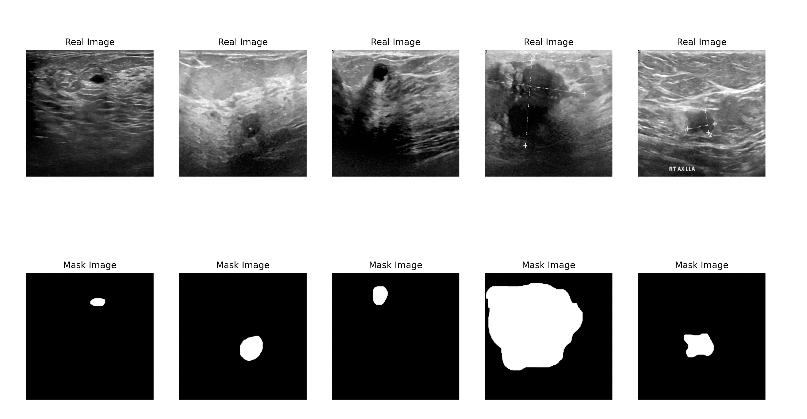

### Breast Ultrasound Images with UNET & MASKR-CNN

# Description

Implementation of UNET architecture on the Breast Ultrasond Dataset from kaggle

# Training

Trained using google colab with a Tesla T4

## Evaluation

Achieved 95% accuracy 
Example of results :

